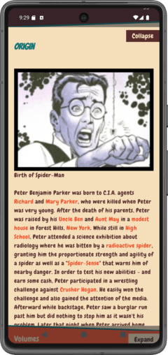

# ComicSnac

ComicSnac is an Android Client for [Comic Vine](https://comicvine.gamespot.com/).
Built using Jetpack Compose.

## Download

Download APK [here](https://github.com/Omasyo/ComicSnac/releases/download/v1.1/app-release.apk).

## Libraries

- [Jetpack Compose](https://developer.android.com/jetpack/compose) - UI toolkit.
- [Hilt](https://dagger.dev/hilt/) - Dependency Injection.
- [Ktor](https://ktor.io/) - Network Client.
- [Coil](https://coil-kt.github.io/coil/) - Image loading library.
- [Kotlin Coroutines](https://kotlinlang.org/docs/coroutines-overview.html)
- [Android Lifecycle](https://developer.android.com/topic/libraries/architecture/lifecycle) - Observe Android lifecycles.
- [Android Navigation](https://developer.android.com/jetpack/compose/navigation) - Navigation component for Jetpack Compose applications.
- [Datastore](https://developer.android.com/topic/libraries/architecture/datastore) - Store key-value pairs or typed objects with protocol buffers.
- [Paging 3](https://developer.android.com/topic/libraries/architecture/paging/v3-overview) - Load data in pages.
- [Kotlinx Serialization](https://kotlinlang.org/docs/serialization.html) - Data serialization and deserialization.
- [Mockk](https://mockk.io/) - Mocking library for Kotlin
- [Junit4](https://junit.org/junit4/) - Testing framework

## Screenshots

&nbsp;&nbsp;&nbsp;&nbsp;
&nbsp;&nbsp;&nbsp;&nbsp;
&nbsp;&nbsp;&nbsp;&nbsp;
&nbsp;&nbsp;&nbsp;&nbsp;
&nbsp;&nbsp;&nbsp;&nbsp;

# License

    Copyright 2023 Omakachukwu Odinakachukwu
    
    Licensed under the Apache License, Version 2.0 (the "License");
    you may not use this file except in compliance with the License.
    You may obtain a copy of the License at
    
       http://www.apache.org/licenses/LICENSE-2.0
    
    Unless required by applicable law or agreed to in writing, software
    distributed under the License is distributed on an "AS IS" BASIS,
    WITHOUT WARRANTIES OR CONDITIONS OF ANY KIND, either express or implied.
    See the License for the specific language governing permissions and
    limitations under the License.
